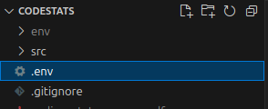
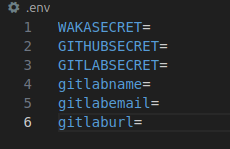
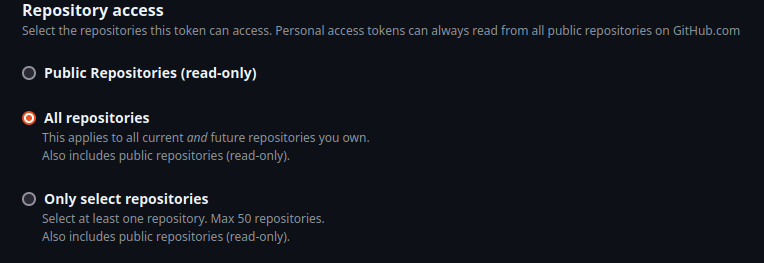
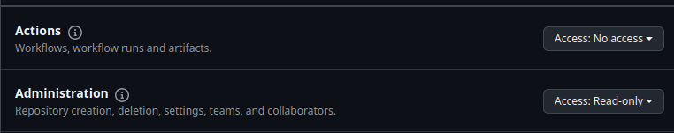
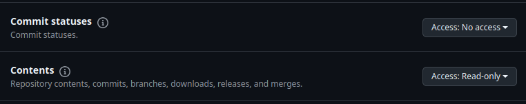
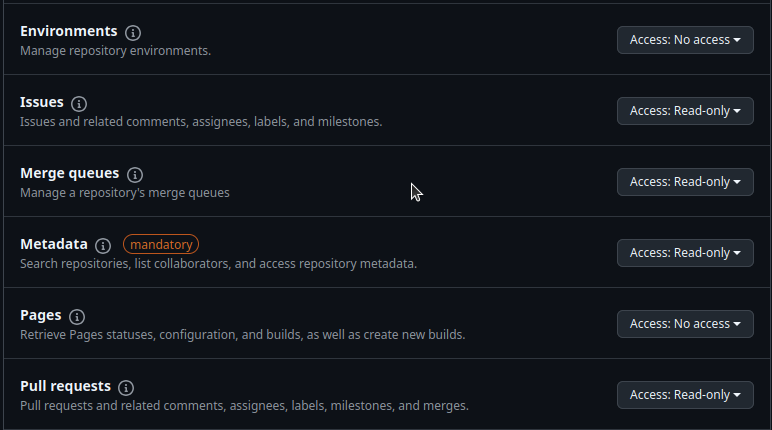
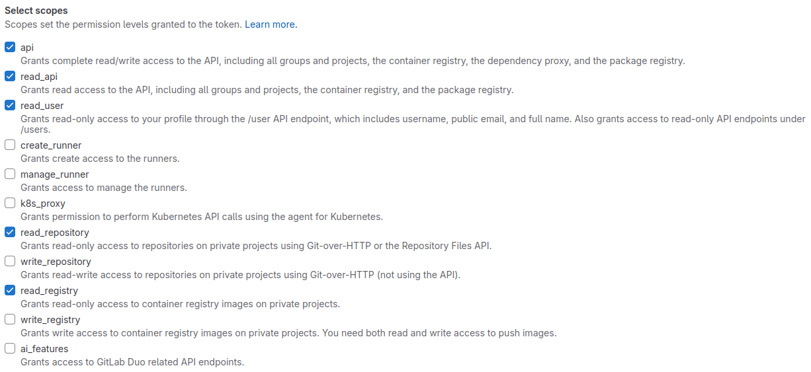

>When you run `docker compose up --build` for the first time, it takes around 2 minutes for your stats to show up, since gathering data takes a long time

# codestats
App that shows programming stats and lets you import it as pdf

## INSTALLATION

### Setting up .env

#### 1. Create .env file to root'



#### 2. Copy and paste this to .env
```
WAKASECRET=
GITHUBSECRET=
GITLABSECRET=
gitlabname=
gitlabemail=
```

*Now your env should look like this*



#### 3. Get wakatime api key

Go to https://wakatime.com/api-key and copy key

Assing it to 'WAKASECRET=waka_ex-amp-l3`' in env

#### 4. Create Github Token

1. Go to https://github.com/settings/tokens?type=beta
2. Generate new token
3. Set repository access to "All repositories"



4. Go to permissions and set
    - Administration = Read-only
    - Contents = Read-only
    - Issues = Read-only
    - Merge queues = Read-only
    - Metadata = Read-only
    - Pull requests = Read-only





5. Scroll down and press "Generate Token"
6. Copy your token and set it in .env to `GITHUBSECRET=github_pat_ex-amp-l3`

#### 5. Create Gitlab Token

1. Go to https://your-git-lab/-/user_settings/personal_access_tokens

*Default is https://gitlab.com/-/user_settings/personal_access_tokens*

2. Add new token
3. Name it
4. Set scopes
- api
- read_api
- read_user
- read_repository
- read_registry



5. Create and copy your personal acces token
6. in .env set it to `GITLABSECRET=glpat-ex4-mpl-3`

#### 6. Name, emai, site

Set rest of the env values, these are needed in gitlabapi

```
gitlabname=Matti meikalainen
gitlabemail=matti.meikalainen@example.fi
gitlaburl=https://gitlab.com
```

Remeber that if it's selfhosted, hostaname is different. Default is https://gitlab.com/

### Run docker compose

